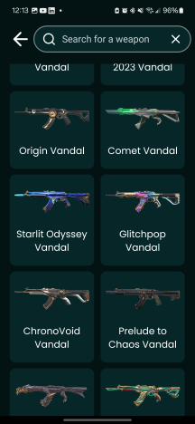

# Valorant Skins App 🎮

This is a mobile application built with React Native and Expo, designed to provide Valorant players with easy access to information about agents, maps, and weapon skins. The app fetches data from the Valorant API to display details such as agent abilities, map layouts, and skin collections.

## Images 🖼️





## Description 📝

The Valorant Skins App aims to be a helpful resource for Valorant enthusiasts. With a clean and intuitive interface, users can quickly search and browse through agents, maps, and weapon skins. The app provides detailed information, including agent abilities, map layouts, and skin variations, making it a valuable tool for both casual and competitive players.

Key features include:

-   **Agent Information 👤:** Detailed profiles of all playable agents, including their abilities and lore.
-   **Map Details 🗺️:** Comprehensive layouts and information about each map in Valorant.
-   **Weapon Skins 🔫:** A complete catalog of weapon skins, including variations and collections.
-   **Search Functionality 🔍:** Easily find agents, maps, or skins with the integrated search feature.
-   **Responsive UI 📱:** A user-friendly interface optimized for mobile devices.

## Technologies Used 💻

-   **React Native ⚛️:** For building cross-platform mobile applications.
-   **Expo 🛠️:** For streamlined development, testing, and deployment.
-   **Valorant API 🌐:** To fetch real-time data about agents, maps, and skins.
-   **React Navigation (Expo Router) 🛣️:** For navigation between screens.
-   **NativeWind 🎨:** For styling using Tailwind CSS syntax.
-   **Expo Video 🎬:** For displaying weapon skin videos.
-   **React Native Reanimated Carousel 🎠:** For image carousels.
-   **React Native Country Flag 🚩:** For displaying agent origin flags.
-   **Google Fonts (Poppins, Zen Dots) 🖋️:** For custom typography.
-   **Feather Icons 🪶:** For icons.

## Setup ⚙️

Follow these steps to set up the Valorant Skins App on your local machine:

1.  **Clone the Repository:**

    ```bash
    git clone https://github.com/chrisdiprima/Valorant-Skins-App.git
    cd Valorant-Skins-App
    ```

2.  **Install Dependencies:**

    ```bash
    npm install
    ```

3.  **Install Expo CLI Globally (if not already installed):**

    ```bash
    npm install -g expo-cli
    ```

4.  **Start the Development Server:**

    ```bash
    npx expo start
    ```

5.  **Run the App:**

    -   Scan the QR code with the Expo Go app on your iOS or Android device.
    -   Or, run the app in an emulator:
        -   For iOS: Press `i` in the terminal.
        -   For Android: Press `a` in the terminal.

6.  **Environment Setup**
    -   Ensure you have Node.js and npm (or Yarn) installed.
    -   Install Expo Go on your mobile device for testing.
    -   Android Studio or Xcode are needed for running emulators.

7.  **Customization**
    -   You can customize the app's appearance by modifying the `tailwind.config.js` and `global.css` files.
    -   Add or modify constants in the `constants` folder.
    -   Replace placeholder images in the `assets` folder.
    -   Update the agentCountries.json file with any changes to agent origins.

## Contributing 🤝

Contributions are welcome! If you find a bug or have an idea for a new feature, please open an issue or submit a pull request.

## License 📄

This project is licensed under the MIT License.
